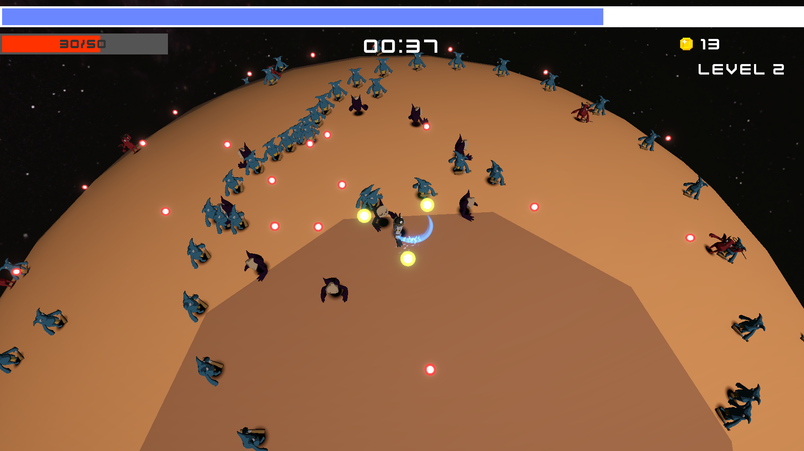
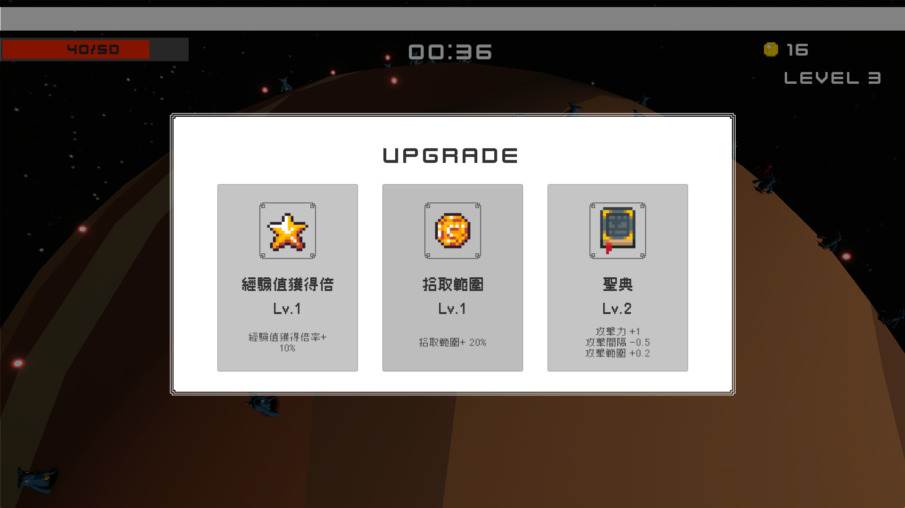

# Planet Survivors

A 3D survivor-like game developed with Unity, featuring spherical movement, automatic combat, character upgrades, and wave-based enemy spawning.

**🎮 Play the WebGL version:**  
[Planet Survivors on itch.io](https://muji548569.itch.io/planet-survivors)



## About the Game
Planet Survivors is a 3D survivor-like game where the player fights enemies while moving across the surface of a spherical planet.

Defeating enemies grants experience points. After leveling up, the player can choose between upgrading weapons or improving character stats.

The main objective is to survive for **120 seconds**.

## Features
- Spherical gravity and character movement
- Camera-relative movement on a spherical surface
- Multiple automatic weapons with different attack behaviors
- Wave-based enemy spawning system
- Multiple enemy behaviors
- Player leveling and upgrade system
- Data-driven weapon and stat upgrades
- Object pooling for frequently spawned objects
- JSON configuration loading
- Audio and UI management
- Windows and WebGL support

## Technical Highlights

### Spherical Movement
Unlike traditional character movement on a flat plane, the player moves along the surface of a spherical planet.

The movement system first calculates the surface normal between the player and the planet center.

The camera's forward direction is then projected onto the tangent plane of the planet surface to create a local camera-relative `Forward` and `Right` coordinate system.

The player's 2D movement input is converted into a tangent movement direction and applied through the `Rigidbody`, while keeping the velocity in the normal direction for jumping and gravity.

This allows the player to move naturally around the planet while maintaining camera-relative controls.

---

### Weapon Architecture
Weapons share common behavior through a base weapon architecture while individual weapon types implement their own attack logic.

The weapon system separates weapon behavior from configuration data:

- `WeaponBase` handles shared logic such as attack timing.
- Concrete weapon classes implement different attack behaviors.
- `WeaponController` manages currently active weapons.
- `WeaponData` stores weapon configuration using ScriptableObjects.
- Weapon level data defines how each weapon changes when upgraded.

This structure makes it easier to add new weapon types without modifying the existing weapon controller logic.

Examples of implemented weapons include:

- Melee sword attacks
- Projectile-based fireball attacks
- Orbiting weapons around the player

---

### Data-driven Upgrade System

The player can improve both character stats and weapons during gameplay.



Upgrade values are separated from gameplay logic and stored in configuration data.

Character upgrade data is loaded from JSON files, while weapon configuration uses ScriptableObjects and level-based data.

This makes balancing values easier because gameplay parameters can be modified without directly changing the core gameplay code.

Examples of upgradeable character stats include:

- Maximum health
- Movement speed
- Attack speed
- Jump strength
- Damage-related attributes

Weapons also have their own level progression and upgrade values.

---

### Object Pooling / Enemy & Projectile Lifecycle

Frequently created objects such as enemies and projectiles use an object pooling system instead of repeatedly calling `Instantiate` and `Destroy`.

Objects follow a reusable lifecycle:

```text
Pool
  ↓
Spawn
  ↓
OnSpawnFromPool
  ↓
Active Gameplay
  ↓
OnReturnToPool
  ↓
Pool
```

This reduces unnecessary runtime allocations and helps avoid performance overhead caused by frequent object creation and destruction.

### Game Initialization

Several gameplay systems depend on configuration data being loaded before the game can start.

A bootstrap initialization flow is used to coordinate these dependencies.

```text
Load Configuration Data
          ↓
     Wait for Result
       ↙       ↘
   Success     Failed
      ↓           ↓
Initialize      Abort
Game Systems  Initialization
```

The initialization process verifies that required managers and configuration data are available before dependent gameplay systems are initialized.

This prevents systems such as weapons or player upgrades from accessing configuration data before it has finished loading.

### WebGL / Asynchronous Data Loading

One issue encountered while adding WebGL support was that StreamingAssets behaves differently between desktop builds and WebGL.

On desktop platforms, configuration files can be loaded directly from the file system.

WebGL builds, however, cannot reliably use File.ReadAllText to access StreamingAssets.

To handle this difference, a platform-aware StreamingAssetLoader was implemented.

```text
Desktop
    ↓
File.ReadAllText

WebGL
    ↓
UnityWebRequest
```

The WebGL version loads configuration files asynchronously using UnityWebRequest, while standalone builds retain direct file access.

The game's initialization flow was also modified to wait for configuration loading to complete before initializing systems that depend on that data.

Loading states are explicitly tracked so initialization can distinguish between:

Loading
Success
Failed

This prevents configuration-loading failures from causing dependent systems to initialize with incomplete data.
